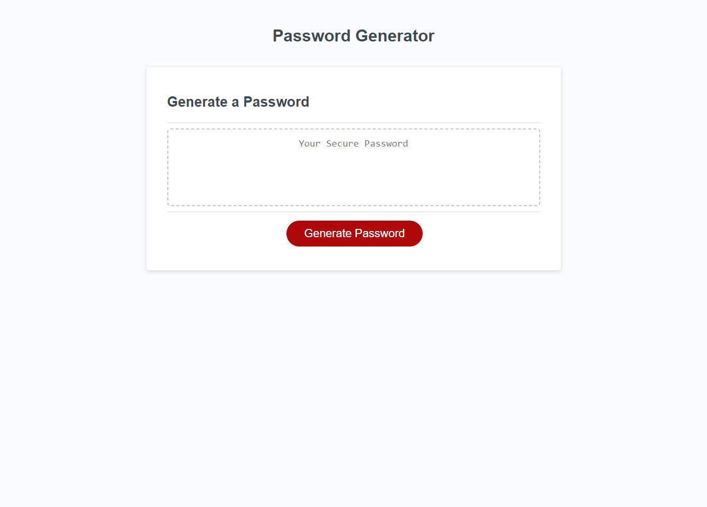

# JS-password-generator

Main topic: Javascript

# Short Description

In this project our goal was to write a generate password function that would write a randomly generated password to the screen depending on the selected criteria. The breakdown of the function is first using if statements to check what criteria were selected and then storing those selected criteria to a new variable. Once we have the new variable we use a for loop to iterate through the new variable as many times as the desired length of the password, selecting a random character each time. Each random character is concatenated into a string that forms the new password taking into consideration the desired length and only the selected criteria.

# Full page screenshot

# Link to deployed application

https://johnfoxwell.github.io/JS-password-generator/

